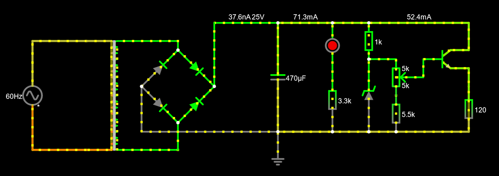
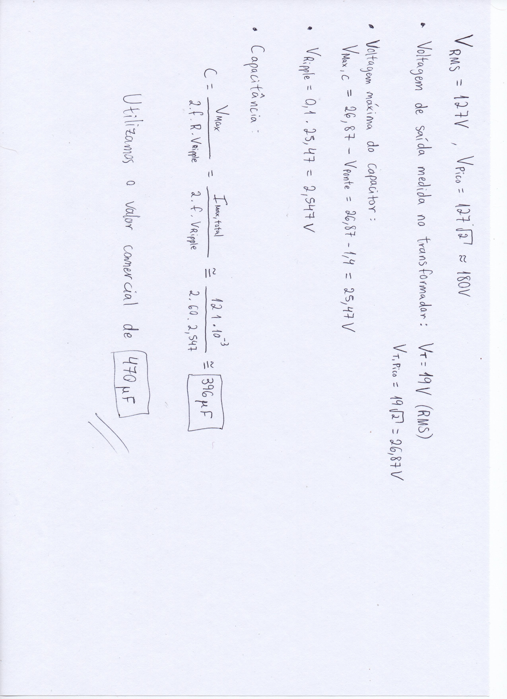
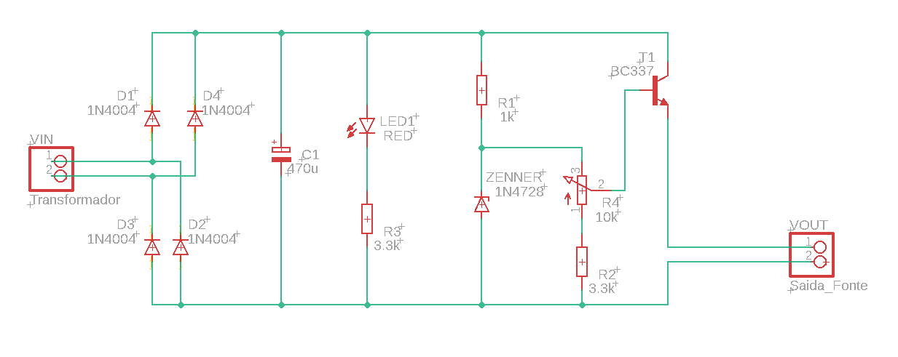
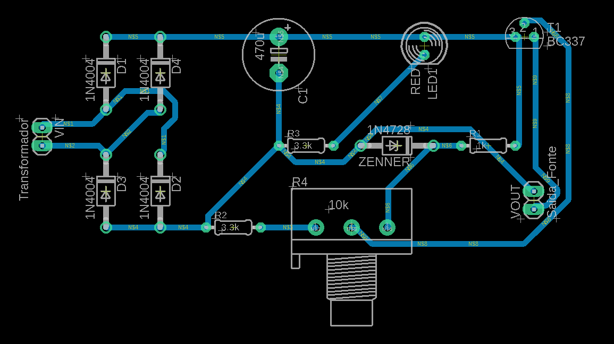
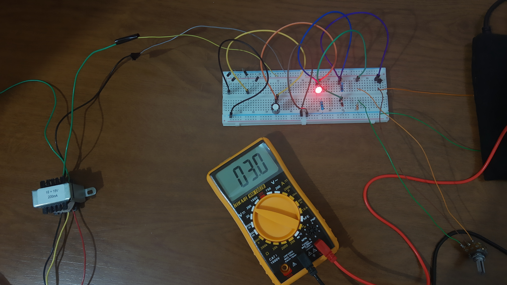
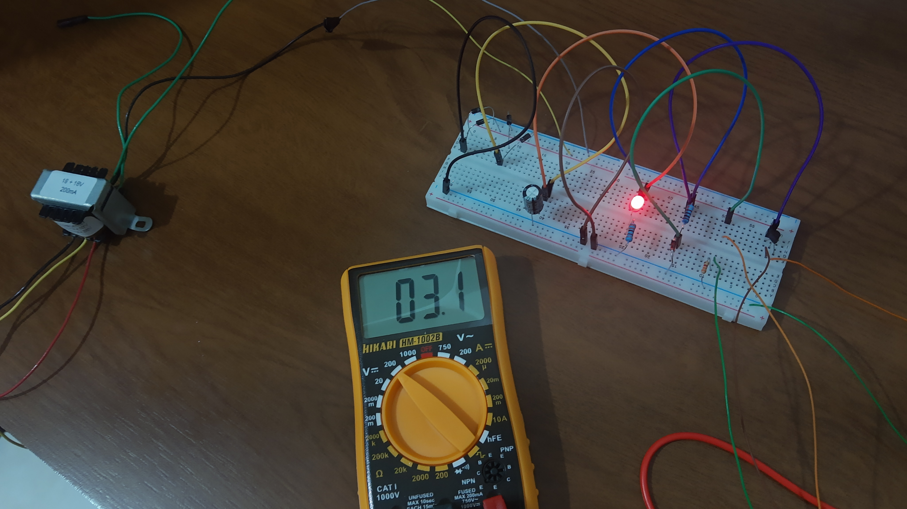
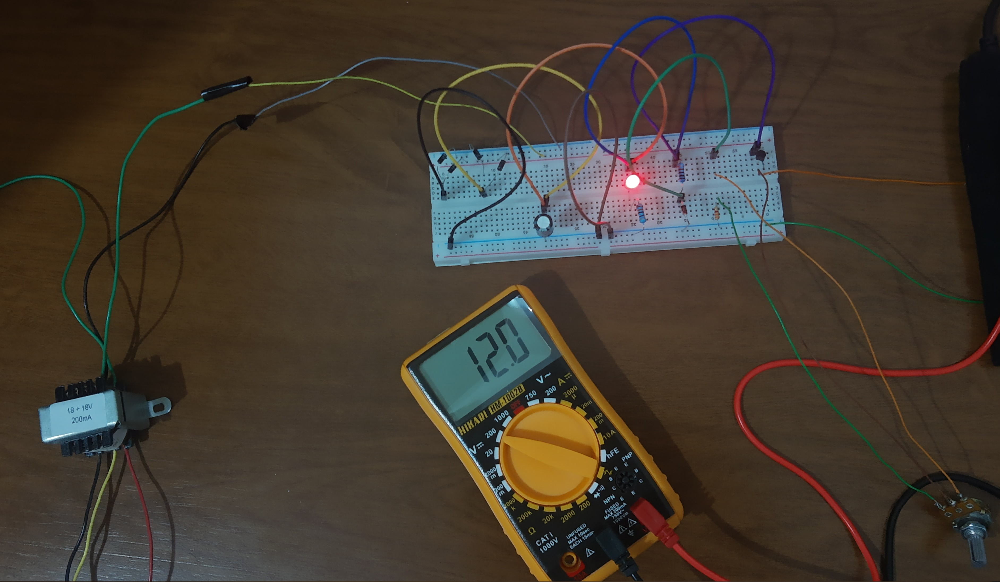

# Fonte de tensão ajustável

## Descrição
Projeto de uma Fonte de Tensão ajustável entre 3V e 12V com capacidade de 100mA.

Entrada: Corrente alternada com tensão eficaz de 127V e 60Hz de frequencia.

Saída: Corrente contínua de no máximo 100mA e tensão entre 3V e 12V. 

## Componentes
| Quantidade | Componentes                  | Valor (R$) |
|------------|------------------------------|------------|
| 10         | Diodo 1N4004                 | R$ 0,20 x 10 = R$ 2,00 |
| 1          | Capacitor 470uF              | R$ 1,20 |
| 2          | Led Vermelho 5mm             | R$ 0,27 x 2 = R$ 0,54 |
| 1          | Resistor 1k ohm              | R$ 0,21 |
| 2          | Resistor 3k3 ohm             | R$ 0,20 x 2 = R$ 0,40 |
| 1          | Potenciômetro 10k            | R$ 4,75 |
| 2          | Diodo Zener (13V)            | R$ 0,25 x 2 = R$ 0,50 |
| 1          | Transistor NPN (BC337)       | R$ 0,70 |
| 1          | [Transformador](https://produto.mercadolivre.com.br/MLB-1253943633-transformador-trafo-1818v-200ma-bivolt-eletronica-_JM)                | R$ 29,99 |
| **Total**  |                              |  R$ 40,29 |

## Explicação dos componentes

* Transformador: é conectado numa tomada de 110V (127V RMS) com corrente alternada. Responsável por reduzir a tensão para 18V (RMS). Na prática, foi medido uma tensão RMS de 19V.

* Ponte de diodo: utilizando 4 diodos, montamos a ponte, a qual é responsável por transformar a corrente alternada proveniente do transformador para uma corrente contínua.

* Capacitor: armazena carga durante o ciclo positivo da tensão alternada e libera essa carga para o circuito no ciclo negativo. Capacitância calculada para um ripple de 10% -> C = 395µF. Foi utilizado um capacitor de valor comercial de 470µF.

* Diodo Zener: regulador de tensão máxima para a saída da fonte. Se a tensão for maior que 13V, o diodo atuará como um curto, mantendo a tensão em 13V naquele ponto.

* Resistores: limitam a corrente do circuito, impedindo que ultrapasse os valores limites dos componentes. No simulador, o resistor de 5k5 ohm após o potenciômetro possui uma resistência maior para que a voltagem mínima de saída seja 3V, mas na prática, devido a erros, o resistor de 3k3 forneceu essa saída mínima desejada.

* Potenciômetro: resistor variável que controla o valor da tensão de saída entre 3 e 12 volts.

* Transistor: permite a passagem da corrente de forma ajustável em conjunto com o potenciômetro.

## Imagem do circuito

#### OBS: resistor de 5k5 trocado por um de 3k3 na prática.

### Link do Falstad: [Circuito Falstad](https://tinyurl.com/2495kd2l)

## Cálculo do capacitor

## Imagem do Esquemático da PCB

## Imagem da PCB

## Fotos do circuito funcionando

### [Vídeo explicativo](https://drive.google.com/file/d/1FKkSimYk40UsKTF8a-7zYxndGOwowRUW/view?usp=sharing)
